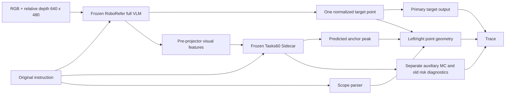

# RoboRefer làm nguồn grounding chính

Ngày 07/10/2026. Biến thể opt-in `pcrau_roborefer_primary_v1`; không thay
`active_experimental_profile.json` hoặc các bundle đóng băng trước đây.

## Mục đích và kiến trúc

Sidecar trước đây học một đường grounding riêng từ feature thị giác và một
text encoder riêng. Đường mới sử dụng cả khả năng hiểu câu và grounding của
RoboRefer-2B-SFT, giữ Sidecar làm nhánh đo phụ trợ.



RoboRefer sinh điểm greedy, max_new_tokens128, cùng suffix normalized point
với pilot RefCOCO. Không dùng bbox, mask hoặc category GT làm input. Không chọn
giữa hai nhánh dựa trên kết quả chấm. Không fallback Sidecar khi point sai định dạng.
Không dùng answerability Sidecar để chặn primary grounding trong phiên bản này.

## Chạy live

```bash
CUBLAS_WORKSPACE_CONFIG=:4096:8 .conda-roborefer/bin/python3.10 -B \
  new/scripts/infer_roborefer_primary.py \
  --rgb path/to/rgb640.png --depth path/to/relative_depth640.png \
  --prompt 'Locate the apple that is right of the purple cube.' \
  --output path/to/primary_prediction.json
```

RGB và relative-depth phải là ảnh uint8 ba kênh 640×480. CLI không tự suy depth.
Backbone/feature worker chạy subprocess với user site tắt; Sidecar chạy runtime
đúng hash/Torch contract của bundle cũ sau khi worker đã thoát. Không đổi environment.

Worker: `new/scripts/roborefer_primary_worker.py`. CLI:
`new/scripts/infer_roborefer_primary.py`. Adapter độc lập:
`new/src/pcrau/roborefer_primary.py`.

## Contract đầu ra

- `target`: raw answer, normalized xy, pixel xy theo image size và điểm liên tục
  trong hệ 640×480. `source` là RoboRefer generation. Parser yêu cầu đúng một
  tuple normalized; giữ floor như scoring public pilot. 1.0 ở mép ngoài ảnh bị
  đánh invalid, không tự clamp sang pixel cuối.
- `target.probability_grid`: null. Một point deterministic chưa là phân bố vị trí.
  Không vẽ Gaussian hoặc one-hot rồi gọi nó là uncertainty của backbone.
- `geometry`: dùng điểm primary và peak anchor P1 trong cùng hệ 640×480, margin12px.
  Đây là tương thích hình học của predictions; binding/presence chưa được chứng nhận.
  `relation_probability` null vì không có joint predictive distribution của hai vật.
  Direct/unsupported/missing anchor báo scope riêng, không xem là relation đã đúng.
- `sidecar_diagnostic`: các map, task distributions, answerability và risk cũ
  được giữ nguyên tên nhánh. MC vẫn đo Sidecar và các task phụ trợ.
- `cross_model_point_disagreement_normalized`: khoảng cách giữa hai prediction
  chia đường chéo800px. Đây là disagreement feature, chưa là xác suất lỗi.
- `decision`: valid point → `REVIEW_UNCALIBRATED`; invalid point →
  `REOBSERVE_INVALID_POINT`. Risk/threshold null. Chưa policy EXECUTE mới.

## Calibration cần làm tiếp

1. Freeze primary point extractor/prompt/precision và schema evidence mới.
2. Chạy train/dev bằng primary, kiểm tra binding và lấy semantic/depth/completion
   quantities tại vị trí primary nếu muốn chúng nói về cùng target.
3. Tạo evidence trên calibration đã tách, fit cho event
   `truth_non_FOUND OR RoboRefer_primary_point_outside_target_mask`, khóa threshold.
   Không thay MAP bằng Sidecar hoặc giữ label lỗi Sidecar làm label mới.
4. Reevaluate IID cũ; báo grounding và selective risk của cùng pipeline.
   Public pilot đã quan sát không dùng để fit/chọn threshold hoặc báo test độc lập mới.

Calibrator33/44/60 hiện hành được fit với MAP Sidecar; thay điểm trong JSON mà
giữ risk cũ sẽ làm hai phần nói về hai prediction khác nhau. Tương tự, entropy/MI
map Sidecar chưa thể gọi là spatial uncertainty của primary RoboRefer point.
Nếu muốn uncertainty riêng cho backbone grounding, cần một cơ chế phân bố
được kiểm chứng; phiên bản này chỉ chuyển nguồn target, chưa triển khai cơ chế đó.

## Đánh giá đã làm

Replay cùng 300 câu RefCOCO đã quan sát: primary281/300 (93.67%), Sidecar101/300
(33.67%). Sửa187, làm sai7; +60pp. Primary đúng bằng đối chứng RoboRefer RGB-D
do giữ nguyên output của nó; không tuyên bố vượt RoboRefer hoặc do MC cải thiện.
Không có selective coverage/risk được hiệu chuẩn cho primary trong phiên bản này.

Báo cáo/case: `plan/ROBOREFER_PRIMARY_PILOT_20261007.md`.
Tests contract: `new/tests/test_roborefer_primary.py`.
