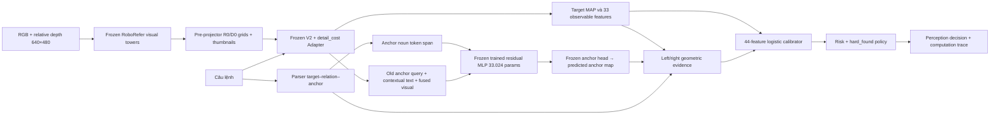

# P-CRA-U — biến thể suy luận không gian và risk đã hiệu chuẩn

Ngày 05/10/2026. Đây là entry point riêng cho biến thể đồ án, chưa thay
`active_experimental_profile.json`. Mục tiêu hiện hành là tích hợp cơ chế có
định nghĩa, chạy được và truy vết được; cải thiện điểm số là mục tiêu bổ sung.

## Luồng kiến trúc đã chạy



Các mask và nhãn thật chỉ vào loss trong pilot trước đây hoặc evaluator ngoài
runtime. Luồng inference trên không nhận mask, object ID, truth, variant hoặc
family. Dataset runner gắn sample/family để ghi file và hậu kiểm, sau forward.

### 1. RGB-D → feature

RGB và **relative-depth model input**, đều uint8 640×480, được xử lý theo
extractor RoboRefer đã có. Không tự đổi metric depth thành relative depth.
Lấy tower output trước projector, 13 tiles×1024×1152; 12 tiles cục bộ ghép 3×4,
average pooling4, LayerNorm thành grid24×32×1152. Thumbnail được mean-pool và
LayerNorm. Bốn tensors được làm tròn FP16 như feature cache lịch sử.

`frozen_rgbd.py` chạy backbone trong subprocess conda sạch
(`PYTHONNOUSERSITE=1`, torch2.5.1/torchvision0.20.1); Sidecar dùng runtime
torch2.13 đã khóa trong bundle. Hai tiến trình chỉ truyền bốn visual tensors.
Giải pháp này xử lý xung đột package hiện có mà không sửa môi trường.
Helper cũ còn tính projector để ghi shape; Sidecar chỉ lấy **pre-projector**.
Không sinh câu trả lời RoboRefer, không robot hoặc ROS trong entry point này.

### 2. Baseline và anchor mới

Baseline giữ checkpoint Adapter đã chọn. `AnchorShadow` lấy contextual text,
old anchor queries và fused visual bằng hook. Parser chọn anchor noun span.
Nhánh P1 tính `q_new = q_old + MLP(mean(text[anchor_span]))` và dùng anchor head
đóng băng xuất map riêng. MLP là checkpoint pilot v2 best epoch8, nay cũng frozen.
Target/answerability/source/edge baseline không nhận nhánh mới làm input.
Direct/unsupported và inactive slots dùng anchor logits cũ chính xác.

Parser hỗ trợ một `locate the ...` clause, direct hoặc `that is left/right of
the ...`, image frame; phrase/token/char spans là kết quả từ prompt. Grammar
ngoài scope báo unsupported. Không khẳng định parser tổng quát cho tiếng Việt,
multi-clause, ternary, depth hay robot/world frame.

### 3. Phép kiểm chứng không gian

Với tọa độ peak target `(t_x,t_y)` và anchor `(a_x,a_y)`, `s=+1` cho right_of,
`s=-1` cho left_of:

`signed_margin = s(t_x-a_x)-12 px`; compatible peak khi margin>0.

Compatibility phân bố:

`c = Σ_i Σ_j P_target(i) P_anchor(j) · 1[s(x_i-x_j)>12]`.

Tính trên lưới24×32, pixel center `(20x+10,20y+10)`; tổng theo column mass
cho kết quả tương đương tổng toàn cặp. `P_anchor` là softmax trên logits dự đoán.
Đây là **mức tương thích hai phân bố dưới giả thiết tích phân bố**, không phải
xác suất danh từ đã bind đúng hoặc quan hệ thật đúng. Logit/sigmoid-max của
anchor giữ riêng để không mất evidence tuyệt đối do normalization.

Binding/presence luôn `UNVERIFIED`. Map vẫn có peak khi vật vắng mặt, vì vậy
không biến peak thành khẳng định có vật. Hình học là evidence đưa vào calibrator;
không hard veto, không sửa target MAP. Có thể nhận ca margin âm; báo case thật
để thể hiện giới hạn của fusion học được, không che hoặc sửa luật hậu nghiệm.

### 4. Evidence trực tiếp và calibration

Producer mới xuất **44 features từ forward hiện tại**:

| Nhóm | Số | Nội dung |
|---|---:|---|
| Evidence baseline | 18 | Heatmap, answerability sau Adapter, source scores, edge consistency, fusion, RGB-D, RR missing |
| Detail evidence | 15 | Target/interior/anchor peaks, mass, edge min, probabilities V2 trước Adapter |
| Parser/anchor | 8 | Scope flags, max logit/sigmoid, entropy, normalized peak, shift so anchor cũ |
| Geometry | 3 | Signed margin/640, compatible peak, pair compatibility |

`observable_answerability_evidence` được baseline tạo **trước** cộng Adapter.
Các trường `base_found/...` phải lấy tensor ấy; không softmax lại logits sau
Adapter để điền vào base fields. Edge consistency chọn slot bằng
`prompt_relation_mask & prompt_anchor_mask`, giống quy tắc dataset hiện có.
Không dùng `edge_target`. Không sinh RoboRefer point: disagreement=0 và missing=1.

Risk là logistic trên vector chuẩn hóa:

`z = b + Σ_k w_k (x_k-μ_k)/σ_k`, `r = sigmoid(z)`.

Event fit là **truth khác FOUND hoặc target MAP ngoài target mask**. Mask/truth
chỉ vào calibration evaluator, không vào inference x. Đây là predictive error
risk của quyết định nhận thức. Entropy/compatibility/source scores là evidence
hoặc proxy; chưa phân rã aleatoric/epistemic hay đo xác suất robot nguy hiểm.

Một calibrator P1_G44 được fit lại từ producer mới trên calibration1000/200family,
L2=0,01, family-crossfit5fold, chuẩn hóa chỉ trên training fold. Ngưỡng chọn OOF
theo hard_found, Wilson upper95%≤7,5%, ít nhất60 accepted family. Fit-all dùng
toàn calibration để có coefficients runtime. Calibration thực hiện sau freeze
weights/source; không fit/chọn ngưỡng bằng train/dev/IID. Dev dùng báo kiểm tra.
Wilson ở đây là quy tắc chọn ngưỡng đã dùng, không bảo đảm thống kê phân phối
cho dữ liệu tương quan trong family hoặc sự dịch chuyển ngoài calibration.

### 5. Quyết định và trace

Predicted FOUND và risk≤threshold → `EXECUTE` **ở mức nhận thức**.
Nếu không nhận: predicted ABSENT→ABSTAIN; AMBIGUOUS→ASK_USER;
INSUFFICIENT_EVIDENCE→REOBSERVE; FOUND bị chặn dùng source score theo luật cũ.
Entry point không phát robot command.

Output JSON chứa prompt/parse/spans, target grid/MAP, predicted anchor peak,
margin/compatibility/status, 44 features, từng contribution vào logit, risk,
threshold và decision. `geometry_raw_logit_effect_vs_zero` là chênh logit nếu
đặt ba raw geometry features=0 trong cùng calibrator. Đây là diagnostic của
phép tính, **không** ablation đã train lại hoặc causal attribution.

## Bundle và sử dụng

Bundle đã kiểm tra:
[bundle.json](../outputs/pcrau_unified_spatial_20261005_r2/bundle.json).
Freeze lock giữ model/config/metadata/residual/source/torch/schema;
manifest giữ hash calibrator/profile. Loader kiểm tra hashes và runtime.
Code thay đổi phải tạo bundle mới, không sửa lock để hợp thức hóa bundle cũ.
Source snapshots và checkpoint MLP nằm trong bundle; baseline model được tham
chiếu bằng đường dẫn/hash vì rất lớn. Bundle hiện dùng trong workspace này,
chưa phải gói portable tự chứa mọi dependency/backbone.

Chạy từ workspace root với **Sidecar interpreter hiện hành**; không thêm
`PYTHONNOUSERSITE=1` cho lệnh ngoài. Worker backbone tự đặt biến đó.

```bash
.conda-roborefer/bin/python3.10 -B new/scripts/infer_spatial_variant.py \
  --bundle new/outputs/pcrau_unified_spatial_20261005_r2/bundle.json \
  --features PATH_TO_FOUR_TENSOR_FEATURE_SAFETENSORS \
  --prompt "Locate the apple that is right of the purple cube." \
  --output PATH_TO_NEW_PREDICTION.json
```

Để đi từ ảnh, thay `--features ...` bằng
`--rgb EXISTING_RGB_MODEL_INPUT.jpg --depth EXISTING_RELATIVE_DEPTH_MODEL_INPUT.png`.
Output đã tồn tại bị từ chối. CLI nhận một observation; API `UnifiedInference`
nhận features có batch dimension và một prompt mỗi hàng. Không thread-safe vì
capture dùng hook tạm; gọi tuần tự. CLI không capture ảnh hoặc điều khiển robot.

## Kiểm chứng và giới hạn hiện tại

13 unit checks đạt; toàn train1600/dev400/calibration1000 đã xuất evidence
trực tiếp. Có bài kiểm tra geometry làm đổi risk/action với calibrator kiểm soát,
và contribution geometry khác0 ở tất cả256/64/160câu trái/phải tương ứng.
Bundle reload tái hiện chính xác 20 mẫu calibration đại diện.

Smoke một cặp RGB-D train thật đi qua backbone: target grid,44features,risk và
decision khớp feature-cache path của cùng câu. Điều đó xác nhận kỹ thuật trên
một observation, chưa chứng minh mọi ảnh hoặc domain đều parity.

S3 chưa chạy IID với producer mới. Số330đúng/33lỗi/363 là **S2 cached-evidence**,
không tự gán cho bundle live này. Anchor dev vẫn48/61; giữ kết quả âm v1/v2,
không đòi gate cải thiện để tích hợp. Hình minh họa8devcases có cả ca đúng,
anchor sai, anchor rỗng và false accept. Xem
[báo cáo S3](../../plan/S3_UNIFIED_SPATIAL_INFERENCE_20261005.md).
