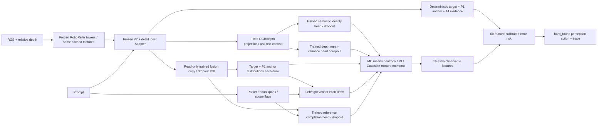

# S6 — tích hợp uncertainty nhiệm vụ bằng MC Dropout: kết quả thực tế

Ngày 07/10/2026. **Đã train auxiliary heads, tích hợp inference, fit calibration
riêng và reevaluate 1.000 mẫu IID cũ bằng pipeline mới.** Không yêu cầu thắng
baseline. Đường RGB-D thật và feature-cache của cùng một observation đã chạy,
cho task outputs/risk/decision khớp chính xác. Không robot motion hoặc LaTeX.

## 1. Kết luận chính

Biến thể hiện có **uncertainty của dự đoán nhiệm vụ**, không chỉ uncertainty
của năm nhãn nguồn. Semantic identity, vị trí, quan hệ, depth và reference
completion dưới occlusion có biến đo cụ thể. MC statistics thực sự đi vào
vector60 và calibrator/decision. Năm source scores cũ vẫn giữ riêng, không
được đổi tên thành năm nguồn aleatoric hoặc năm nguyên nhân vật lý.

IID: **337 ca đúng +34 lỗi /371 lượt nhận**, coverage37,10%, selective risk9,16%.
Live44 trước đó:330+33/363, coverage36,30%, risk9,09%. Thêm7 ca đúng nhưng thêm1
lỗi. Brier/NLL/ECE/AURC tốt hơn ở point estimate; CI Brier/NLL/risk chứa0.
Budget7,5% vẫn chưa đạt trên IID. Đây là **reevaluation IID đã quan sát**,
không phải test mới độc lập, không guarantee an toàn hoặc thắng toàn diện.

## 2. Kiến trúc thực sự chạy



Backbone/text/query representations giữ cố định. MC lấy mẫu trained fusion
residual dropout và ba task-head dropouts, p=0,1,T=20. P1 query/residual và
target/anchor heads đóng băng. Không `.train()` original baseline, không
modality-dropout ảnh, không mask/variant/ID oracle làm input. Không gọi đây
là toàn bộ epistemic uncertainty của VLM hoặc posterior Bayes chính xác.

## 3. Năm nhóm thực sự đo gì?

| Nhóm | Biến đo/đầu ra | Objective hoặc cơ chế | Phạm vi/giới hạn |
|---|---|---|---|
| Semantic | Phân bố22 class gồm background tại predicted target/anchor node; probability noun class khi parser hỗ trợ | RGB projection128 → MLP128/dropout → class logits; unweighted categorical CE với instance labels | Closed-set identity ở node, chưa phân bố matching giữa mọi instance; hai apple cùng lớp chưa được phân biệt chỉ bằng head này |
| Spatial | Target/anchor maps qua các MC draws; entropy và MI | Trained frozen Sidecar fusion được lấy mẫu; cùng target/anchor heads | Softmax-normalized representation từ baseline BCE+Dice; không tự calibrated spatial posterior hoặc covariance sai số vật lý |
| Relation | Bernoulli về việc cặp vị trí dự đoán thỏa left/right12px; PE/MI qua draws | Tích phân kernel hình học trên hai marginal maps mỗi draw | Product-of-marginals approximation, chưa xác nhận binding/presence; ngoài scope trả unsupported/direct bypass |
| Depth | Gaussian mixture tại deterministic predicted target pixel: mean, conditional variance, variance giữa MC means, quantiles95% | RGB+depth projections256 → MLP128/dropout → mean/variance; Gaussian NLL | Reference là sensor metric depth mô phỏng; modeled conditional variance chưa chứng minh là noise vật lý thuần |
| Occlusion/completion | Categorical location density trên reference-visible target support khi có vật che thêm; PE/MI | Fused128 + noun/text128 + original target logit + xy → residual head/dropout; CE trên mask-area distribution | Khôi phục vùng đã nhìn thấy trong ảnh reference; không full amodal shape, không tách riêng causal occlusion uncertainty |

Semantic PE/MI và spatial PE/MI đo hai biến khác nhau, không lấy cùng một
heatmap rồi đặt hai tên. Completion density có objective categorical riêng;
pixel location label được định nghĩa là điểm lấy theo mask-area distribution.
Noun nằm ngoài catalog/parser trả missing flag, không lấy annotation bù vào.

Cho categorical/Bernoulli output:

`p_bar=mean_t p_t; PE=H(p_bar); EE=mean_t H(p_t); MI=PE-EE`.

Entropy normalize theo log(number of outcomes). MI là conditional model
disagreement trong phạm vi được lấy mẫu; EE chưa là aleatoric noise được nhận
dạng. Depth: `Var_total=mean_t variance_t + Var_t(mean_t)`; interval lấy quantile
của Gaussian mixture, không cắt/chỉnh interval để khớp reference. NLL density
có thể âm theo đơn vị mét, không phải lỗi loss.

## 4. Dữ liệu/nhãn bổ sung và ảnh để kiểm tra

Giữ320train/80dev family,1600/400 presentations. Archive đã có instance labels
và metric-depth cho mọi record; một số variants dùng chung capture. Supervision
semantic/depth được nối từ tài nguyên này, không tạo thêm family độc lập.

Supplement completion lọc clean FOUND với một target; CameraInfo/TF bằng nhau,
chỉ requested pose occluder đổi. Observed instance support phải nằm trong
reference dilation2px. Hidden core dùng erosion2px để bỏ biên/jitter. Đây là
kiểm tra metadata và mask, không chứng minh mọi actual object pose hoàn toàn
bất biến hoặc reference là amodal toàn vật.

- 124 train/32 dev eligible pairs; chỉ9train/6dev có hidden core≥2% reference.
- Những cặp không có che đáng kể vẫn là negative/control pairs.
- Masks mới chỉ vào loss/evaluator, không vào `TaskInference` hoặc risk inputs.
- Không capture mới, không chỉnh ảnh/thêm vật bằng AI. Ảnh thực từ archive.


Trong preview: ảnh trái là clean reference, giữa là physical occluder capture,
phải là overlay xanh phần còn thấy/tím hidden reference core. Sáu cặp train/dev
đã được xem trực tiếp và hiển thị cho người dùng trong session. Nguồn/hashes:
[supplement](../new/outputs/pcrau_task_uncertainty_20261007/data/supplement.json).

## 5. Training, preflight và freeze/calibration

Chỉ87.199 auxiliary parameters được AdamW học: lr3e-4,weight decay1e-3,
seed24082026,batch4family/20presentation,max15epoch,patience3,clip5.
Loss=semantic CE + depth Gaussian NLL + completion categorical CE. Dev joint
NLL chọn best epoch15. Depth NLL âm là log-density hợp lệ. Một seed/pilot,
không thí nghiệm độc lập nhiều seed hay ablation riêng từng loss/head.

Ba unit tests kiểm tra entropy/MI/variance identities, loss/gradient hữu hạn
và oracle boundary. Preflight20dev: replay rows/raw samples cùng seed exact,
RNG/model giữ nguyên, spatial maps và depth means thực sự thay đổi qua MC.
RNG được fork/restore; dropout tắt sau sampling. Original baseline vẫn eval.

Frozen model rồi chạy1000calibration/200family với producer60features live.
LogisticL2=.01,family-crossfit5fold, standardization fit từng training fold;
fit-all cho runtime. Không fit/chọn checkpoint/threshold bằng IID.

16 scalar thêm gồm semantic class PE/MI và noun score/missing, spatial MI,
relation PE/MI, depth conditional/MC variance, completion PE/MI/unobserved mass.
Unobserved mass dựa trên predicted visible sigmoid map, không ground-truth
occlusion mask. Những scalar này thật sự có coefficients/contributions trong
logit risk, không chỉ ghi ra một panel.

Event risk: `truth non-FOUND OR deterministic target MAP outside target`.
Target MAP/answerability và source heads gốc không đổi. Profile mới:

- Threshold **0.37876498603729764**, hard_found, budget7,5%, min60family.
- Calibration OOF nhận362/lỗi17, risk4,696%,Wilson upper7,391%: criterion PASS.
- Calibration fit-all nhận364/lỗi15: resubstitution, không test.
- IID371/lỗi34, risk9,164%,Wilson upper12,534%: **budget chưa đạt**.

### Revision/provenance

R1 numerical guard bắt relation column mass float32 hơi vượt1. R2 dùng float64
normalization trước tích phân, không chỉnh confidence theo nhãn; xem
[revision](S6_NUMERICAL_REVISION_20261007.md). R2 train/dev hoàn tất; calibration
artifact export không hoàn tất, giữ nguyên mọi file kể cả placeholders.

Recovery r3 lưu raw batches và replay1000cal observable outputs khớp r2 sau
JSON roundtrip. Check đầu tiên so tuple với JSON list đã fail; sửa phép so sánh
serialization, không sửa predictions hoặc train lại. R3 mới fit calibration
và chạy IID với bundle khóa. Reporter r1 fail ở case parser unsupported; r2
chỉ sửa hiển thị unsupported, không sửa model/parser/calibrator/số liệu.

`bundle_release.json` chỉ làm rõ metadata đã calibrated, giữ parent manifest
đã dùng trước IID và hash của nó; neural/checkpoint/features/cal/profile cùng
byte. Các artifact thất bại không được đổi thành kết quả PASS.

## 6. Kết quả của đúng pipeline trên IID cũ

| Metric | Live44 | Tasks60 MC |
|---|---:|---:|
| Nhận đúng |330|337|
| Lỗi nhận |33|34|
| Lượt nhận |363|371|
| Coverage |36,30%|37,10%|
| Selective risk |9,0909%|9,1644%|
| Brier |0,075631|0,072483|
| NLL |0,252410|0,243317|
| ECE10 |0,030122|0,026791|
| AURC |0,255313|0,249330|
| PIT target-present |775/835|775/835|
| FOUND MAP hit |405/420|405/420|
| Answerability accuracy |81,10%|81,10%|
| Anchor visible hit |131/153|131/153|

Paired decisions: thêm9correct/6error accepts, bỏ2correct/5error accepts,
22decision changes. CI95% bootstrap5000 theo200family (models/threshold fixed):

- Coverage delta+0,80pp,CI[-0,10;+1,70]pp.
- Correct acceptances/sample delta+0,70pp,CI[+0,10;+1,40]pp.
- Selective risk delta+0,0735pp,CI[-1,7184;+1,7724]pp.
- Brier delta−0,003148,CI[-0,008457;+0,001923].
- NLL delta−0,009093,CI[-0,026157;+0,007167].

CI không chứa uncertainty do các vòng chọn dev/fit lịch sử. Không quy lợi ích
cho riêng MC, completion hoặc semantic head vì hệ thống thay đồng thời heads,
features, calibrator và threshold; chưa có ablation cô lập. Không fit theo IID.


## 7. Task metrics và uncertainty diagnostics

IID closed-set identity tại predicted target node:943/1000=94,30%; foreground
accuracy94,42% trên985nodes. Không phải semantic target/anchor binding accuracy
trên mọi instance. Noun matching Brier0,071791 trên477scope/catalog samples.
Relation centroid reference:114/128=89,06%,Brier0,076844; chỉ một visible requested
target và anchor, reference từ instance-mask centroids/12px, không lấy FOUND
làm nhãn quan hệ. Direct/unsupported/missing không được chấm như quan hệ đúng.

Depth ở predicted pixel: MAE0,029930m≈2,99cm,RMSE0,042631m≈4,26cm; interval
nominal95% cover99,4% trên1000reference samples. Interval **còn quá rộng**, không
tuyên bố head depth đã calibrated95%. Vị trí chọn sai vẫn có thể dự đoán depth
đúng của vật/nền tại pixel ấy; chưa là grasp depth accuracy của target thật.

Dev MI error-detection AUROC: semantic0,8856 trên400/32errors; spatial0,7171
trên335target-present/9errors; relation0,8339 trên54/14errors. Dev đã dùng
chọn checkpoint, các mẫu số nhỏ và phụ thuộc family; đây là diagnostic mô tả,
không xác nhận độc lập hoặc chứng minh MI luôn nhận biết lỗi. Depth variance
vs absolute error Spearman0,266; không dùng p-value cấp sample làm claim độc lập.

### Completion dưới occlusion

Dev32eligible reference pairs: completion PIT32/32 so baseline31/32, mean
reference mass0,9324 so0,9863 **giảm**. Sáu meaningful-hidden pairs: hidden-core
mass0,2134 so0,1409 **tăng**. Train9meaningful pairs:0,1683 so0,2482 **giảm**.
Không kết luận completion thắng; nó đã học objective và có output đúng định
nghĩa reference-point distribution, nhưng bằng chứng ít và không đồng đều.
Chưa đánh giá reference-completion riêng trên IID vì supplement train/dev
được khóa trước fit; không tự suy số IID full-amodal từ visible masks.

## 8. Case thật và entry point

Ba dashboard2×3 có actualRGB, semantic classes, relation/scope, MC map,
reference completion và depth interval. Ground-truth contours chỉ là evaluator
overlay. Có cả unsupported case, không dựng parser/anchor giả để làm đẹp.


[Các case JSON/PNG/PDF](../new/outputs/pcrau_task_uncertainty_20261007/evaluation_r3/report_r2/),
[paired changed decisions](../new/outputs/pcrau_task_uncertainty_20261007/evaluation_r3/test_iid/changed_decisions.jsonl).

```bash
.conda-roborefer/bin/python3.10 -B new/scripts/infer_task_variant.py \
  --features PATH_TO_SAFETENSORS \
  --prompt "Locate the apple that is right of the purple cube." \
  --output PATH_TO_NEW_JSON.json
```

Cũng nhận `--rgb EXISTING_RGB.jpg --depth EXISTING_RELATIVE_DEPTH.png` thay
features. Metric-depth reference không làm input. Bundle default là release
manifest riêng, active profile không đổi. CLI không capture/robot.

Smoke một dev RGB-D observation: task distributions, risk và decision exact
so cùng feature cache, seed/T như nhau. Không suy end-to-end parity mọi ảnh.
IID latency median193,93ms/batch20 cho cache→Sidecar/MC/statistics; không lấy
batch throughput làm latency ảnh mới hoặc gọi realtime robot.

## 9. Paper, code và artifact

- [Kendall & Gal2017](https://proceedings.neurips.cc/paper_files/paper/2017/file/2650d6089a6d640c5e85b2b88265dc2b-Paper.pdf): task likelihood, depth modeled variance và MC.
- [Gal, Islam & Ghahramani2017](https://proceedings.mlr.press/v70/gal17a/gal17a.pdf): MC mean probabilities/entropy/MI.
- [PSGP, WACV Workshops2026](https://openaccess.thecvf.com/content/WACV2026W/SG4SI/papers/Li_Probabilistic_Scene_Graph_Prompting_Uncertainty-Aware_Structured_Reasoning_in_Multimodal_LLMs_WACVW_2026_paper.pdf): uncertainty propagation qua structured predictions; không tái hiện soft prompting/full graph.
- GCA tiếp tục tham khảo parse/geometry. Không gọi hệ này là FUSE Bayesian fusion.
- [Protocol trước optimizer](S6_TASK_UNCERTAINTY_PROTOCOL_20261007.md).
- [Heads/sampler](../new/src/pcrau/task_uncertainty.py), [live integration](../new/src/pcrau/task_inference.py), [CLI](../new/scripts/infer_task_variant.py).
- [Training lock](../new/outputs/pcrau_task_uncertainty_20261007/training_lock.json), [training result](../new/outputs/pcrau_task_uncertainty_20261007/training_result.json).
- [Bundle release](../new/outputs/pcrau_task_uncertainty_20261007/evaluation_r3/bundle_release.json), [summary](../new/outputs/pcrau_task_uncertainty_20261007/evaluation_r3/summary.json).
- Raw train/dev samples ở evaluation_r2; raw calibration/IID chia batches trong evaluation_r3. Reference evaluator và observable outputs tách file.

## 10. Phát biểu có thể đưa vào đồ án

> Biến thể P-CRA-U mô hình hóa danh tính lớp của đối tượng dự đoán, vị trí,
> quan hệ trái/phải, depth và reference completion dưới che khuất. MC Dropout
> ước lượng bất đồng trong các nhánh đã khai báo; bằng chứng từ nhiệm vụ được
> hiệu chuẩn thành xác suất lỗi nhận thức và tham gia quyết định chọn lọc.

**Chưa thể phát biểu:** đã phân rã năm nguyên nhân uncertainty độc lập, đã
nhận dạng aleatoric/epistemic thuần toàn VLM, semantic graph exact match,
amodal object recovery đầy đủ, uncertainty3D robot an toàn, đạt budget IID
hoặc chứng minh riêng MC cải thiện kết quả. Mục tiêu tích hợp theo phạm vi
trên đã đạt; những claim mạnh hơn vẫn cần dữ liệu/protocol/bằng chứng khác.

## 11. Kiểm chứng artifact cuối

5 unit tests PASS; 4.000 observations đã recompute PE/EE/MI, mean distributions,
Gaussian mixture moments/quantiles từ raw samples, khớp exact. 2.000 calibration/IID
risk/decision replay exact; 1.000 IID baseline outputs/reference decisions khớp
live44 cũ. 1.435 protected files và 5.602 archive source files giữ hash. Sáu cặp
ảnh supplementary, ba dashboard và biểu đồ IID đã xem trực tiếp. CLI default
release cho outputs exact so parent đã đánh giá.

[Final verification](../new/outputs/pcrau_task_uncertainty_20261007/evaluation_r3/final_verification.json).
