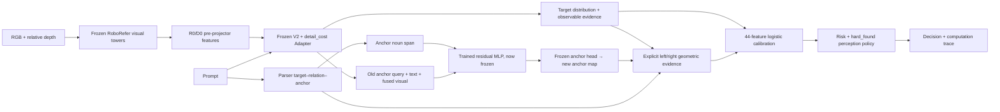

# P-CRA-U — tổng hợp kiến trúc tích hợp và kết quả IID của bundle live

Ngày 07/10/2026. **Đã hoàn thành reevaluation 1000 mẫu IID cũ/200 family bằng
chính bundle live r2 đã khóa.** Kết quả: 330 ca đúng và 33 lỗi trong 363 lượt
nhận, risk 9,09%, coverage 36,30%. Baseline nhận 327 đúng và 34 lỗi/361,
risk 9,42%, coverage 36,10%. Đây là cải thiện nhỏ ở point estimate; CI vẫn chứa
0 và budget 7,5% chưa đạt. Mục tiêu tích hợp cơ chế của người dùng đã hoàn thành,
không đòi thắng baseline để đưa phương pháp vào đồ án.

## 1. Kiến trúc nào đã triển khai và đánh giá?

Luồng trên thực sự chạy. RGB-D model input đi qua backbone đã smoke ở S3;
S4 dùng feature cache từ cùng extractor, rồi chạy lại Sidecar, anchor, verifier,
evidence và risk cho toàn IID. Không extract lại backbone 1000 ảnh, không
capture mới. **Cache visual features khác với cache prediction evidence**:
44 features của calibrator trong lượt này được tạo từ forward hiện tại,
không sao chép 33 trường từ prediction JSONL cũ.

Nhánh P1: `q_new = q_old + MLP(mean(text[anchor_span]))`; MLP có 33.024
tham số, dùng checkpoint pilot v2 best epoch 8 đã chọn bằng dev, nay đóng băng.
Nhánh mới không quay vào target head, graph embedding hoặc answerability Adapter.
Vì vậy target MAP và answerability vẫn là baseline; thay đổi chính nằm ở
predicted anchor evidence và phép tính risk/decision.

Parser hỗ trợ direct hoặc một quan hệ `left_of/right_of` trong image frame,
theo grammar `locate the ... that is left/right of the ...`. Xuất noun spans,
predicate và frame từ câu lệnh, không từ mask/ID. Câu ngoài scope trả unsupported;
không mô tả là parser ngôn ngữ tổng quát, scene graph exact match hoặc reasoning 3D.

## 2. Suy luận không gian và uncertainty có nghĩa gì ở đây?

Verifier kiểm tra ràng buộc trên **đối tượng dự đoán**:

- Peak margin: `s(t_x-a_x)-12 px`, với s=+1 cho right_of, s=−1 cho left_of.
- Peak compatible khi margin>0.
- Distribution compatibility: tổng `P_target(i)P_anchor(j)` trên cặp ô thỏa
  `s(x_i-x_j)>12`, dưới phép tích hai phân bố. Giữ riêng max logit/sigmoid của
  anchor để không suy presence từ softmax peak.

Các đại lượng đó có phép tính thật và đi vào risk. Verifier là **evidence-only**:
không hard veto mọi margin âm, không sửa target MAP, không khẳng định danh từ
đã bind đúng vật. Binding và presence trong trace luôn `UNVERIFIED`. Một map
có peak khi anchor không hiện diện vẫn là lỗi/giới hạn cần hậu kiểm.

Output uncertainty chính là **predictive error risk được hiệu chuẩn**, event:

`error = truth non-FOUND OR target MAP ngoài target mask`.

Đó là xác suất lỗi nhận thức theo event đã định nghĩa, không xác suất robot
nguy hiểm. Heatmap entropy, source scores và geometry compatibility là
evidence/proxy; không tự gọi chúng là phân rã aleatoric/epistemic hay nguyên
nhân nhân quả của lỗi. Spatial source trong baseline vẫn là weak label từ
AMBIGUOUS; relation edge vẫn là proxy.

Cách viết phù hợp cho đồ án: **“P-CRA-U bổ sung parser target–relation–anchor,
anchor được điều kiện hóa theo cụm danh từ và phép kiểm chứng ràng buộc hình
học trên predictions; evidence quan sát và quan hệ được hiệu chuẩn thành risk
lỗi nhận thức để điều khiển chính sách nhận/từ chối.”** Tham khảo GCA/FUSE là
hướng thiết kế thích nghi; không tuyên bố tái hiện agent GCA hoặc Bayesian/GP
uncertainty decomposition của FUSE. Tên module không thay cho bằng chứng tác dụng.

## 3. Bundle, dữ liệu và protocol

[Bundle live r2](../new/outputs/pcrau_unified_spatial_20261005_r2/bundle.json):

| Thành phần | Giá trị đã khóa |
|---|---|
| Manifest SHA256 | `0aacaedf3fa27a2686f936893f5e694b7bea88eeb0675da6503238eecd126446` |
| Freeze SHA256 | `5478ac842cab60f8a2bff5e7c8a193b7f806f374ee63b72e38a38f68fa1da81a` |
| Baseline checkpoint SHA256 | `5a326a8040bfbabfadf3f57fff51fd90be3845438c9a3a8c6ee41bdd1e0fa045` |
| P1 residual source SHA256 | `2bbff4da63d49d115f98a5dfd72db05ef90b200e9e6f96a586fa4c216e294347` |
| Live calibrator SHA256 | `61c1c27d5eab3e90841c4b81965b28363cd72de3d7b80ad6b2751918f6fa195a` |
| Live profile SHA256 | `629dd7c0ca184b81b2dd4914f625ea3ebbe57a2ecac1c357b7010a10132e6cbc` |
| Live threshold | `0.2889643687106893` |
| Official baseline threshold | `0.2611932834526145` |

Dataset và split giữ nguyên: train 320/dev 80 family, mỗi family 5 variants;
calibration 200/IID 200 family, mỗi tập 1000 mẫu. Augmentation cũ không làm tăng
số family train độc lập. Dev chọn neural checkpoint; calibration fit sau freeze;
S4 không fit calibration, chọn model/features hoặc ngưỡng từ IID.

Calibrator live nhận 18 baseline features + 15 detail evidence + 8 parser/anchor
features + 3 geometry features. Phân biệt probabilities V2 trước Adapter và
probabilities sau Adapter. Logistic L2=0,01, family-crossfit 5 folds; threshold từ
OOF với Wilson upper95%≤7,5%, ít nhất60 accepted family. OOF nhận 351/lỗi 16,
Wilson upper 7,2757%; calibration fit-all nhận 357/lỗi 17 là resubstitution.
Không biến quy tắc Wilson này thành bảo đảm risk với dữ liệu family tương quan
hoặc phân phối mới.

[Protocol S4](S4_LIVE_IID_PROTOCOL_20261007.md) và
[execution lock trước forward](../new/outputs/pcrau_unified_spatial_iid_20261007/pre_iid_execution_lock.json)
đã ghi trước lượt đánh giá. Runtime chỉ nhận bốn visual tensors và prompt.
Sample/family do driver gắn sau predict. Masks/truth chỉ đọc sau khi đã lưu
hết 1000 runtime decisions. Baseline predictions chỉ đọc để đối chứng sau đó.

IID này đã được quan sát và phân tích trong lịch sử: **reevaluation**, không
phải test xác nhận mới độc lập. Active profile hiện hành không được thay.

## 4. Kết quả của chính bundle live

Nguồn [summary](../new/outputs/pcrau_unified_spatial_iid_20261007/summary.json) và
[CSV đối chiếu](../new/outputs/pcrau_unified_spatial_iid_20261007/report_r2/comparison.csv).

| Chỉ số IID | Baseline Adapter + logistic33 | Live P1 + verifier + logistic44 |
|---|---:|---:|
| PIT target-present | 775/835 = 92,81% | 775/835 = 92,81% |
| FOUND-only MAP đúng | 405/420 = 96,43% | 405/420 = 96,43% |
| Answerability accuracy | 81,10% | 81,10% |
| Answerability macro-F1 | 0,809686 | 0,809686 |
| Lượt nhận | 361/1000 | 363/1000 |
| Nhận đúng | 327 | 330 |
| Lỗi nhận | 34 | 33 |
| Coverage | 36,10% | 36,30% |
| Selective risk | 9,42% | 9,09% |
| Nhận đúng / valid405 | 80,74% | 81,48% |
| Valid bị từ chối /405 | 78 | 75 |
| Brier, error event trên 1000 | 0,07710818 | 0,07563066 |
| NLL | 0,25706567 | 0,25240986 |
| ECE10 | 0,03108022 | 0,03012214 |
| AURC trên 1000 | 0,25574810 | 0,25531289 |

33 lỗi nhận live gồm 22 truth INSUFFICIENT_EVIDENCE,6 ABSENT và5 FOUND nhưng MAP
sai. Prevalence composite error là 59,5% trên 1000; không áp chuẩn phổ quát
AURC<0,1. Live empirical risk 9,09% và Wilson upper 12,49% đều vượt budget 7,5%.
Không chọn lại threshold từ đường risk–coverage để làm đẹp test.

Hình quét thứ tự risk trong các sample predicted FOUND để mô tả. Chấm là
profile đã khóa. AURC ở bảng tính trên toàn1000mẫu, không cùng population với
đường đã lọc FOUND của hình.

### Anchor và phạm vi geometry

160 horizontal samples;153 anchor visible, 7 anchor mask rỗng khi hậu kiểm.
Anchor M0 trúng 117/153=76,47%; P1 trúng 131/153=85,62%. Paired sửa 16/broken 2.
Các số này được tính lại từ forward và masks hậu kiểm của lượt S4, không dùng
IID chọn lại checkpoint. P1 vẫn sai 22 visible cases, không đồng nghĩa đã giải
quyết binding. Anchor dev lịch sử vẫn 48/61; không sửa thành 49/61 PASS.

| Scope IID | Mẫu | Baseline nhận đúng/lỗi | Live nhận đúng/lỗi |
|---|---:|---:|---:|
| Direct bypass | 350 | 255/9 | 255/9 |
| Horizontal được verifier hỗ trợ | 160 | 12/6 | 13/4 |
| Parser unsupported | 490 | 60/19 | 62/20 |

Hình học chỉ thực hiện trên 16% IID. Ngoài scope vẫn có quyết định khác do
calibrator44 và threshold khác baseline33; không gọi thay đổi unsupported là
ca sửa trực tiếp nhờ geometric verification. Risk riêng horizontal 4/17=23,53%
(vs 6/18=33,33%) vẫn cao và số nhận nhỏ; không lấy tỷ lệ tổng 9,09% làm bằng
chứng mọi câu relational đều đáng tin.

## 5. Paired changes và CI theo family

Đổi 8 quyết định nhận/từ chối, chi tiết tại
[paired changes](../new/outputs/pcrau_unified_spatial_iid_20261007/paired_decision_changes.jsonl):

| Hướng thay đổi | Số |
|---|---:|
| Thêm lượt nhận đúng | 4 |
| Mất lượt nhận đúng | 1 |
| Thêm lượt nhận sai | 1 |
| Loại lượt nhận sai | 2 |

Bootstrap 200 family, 5000 resamples, seed 24082026; giữ models/profiles cố định.
Các deltas live−baseline, trừ Brier/NLL là đơn vị metric, phần còn lại là pp:

| Metric | Delta | CI95% |
|---|---:|---|
| Coverage | +0,20pp | [−0,30; +0,80]pp |
| Correct accepts/1000 | +0,30pp | [−0,10; +0,80]pp |
| Selective risk | −0,3274pp | [−1,2937; +0,4768]pp |
| Valid recall | +0,7407pp | [−0,25; +1,8827]pp |
| Brier | −0,00147752 | [−0,00338246; +0,00025901] |
| NLL | −0,00465581 | [−0,01011999; +0,00007940] |

Tất cả các CI này chứa 0. Kết luận là cải thiện nhỏ tại point estimate, chưa
chứng minh thắng rõ về thống kê. CI không bao gồm uncertainty từ checkpoint
selection/calibrator fitting và không khắc phục lịch sử IID đã quan sát.

## 6. Case thật: sửa được, làm sai và giới hạn

[Bảng case và trace](../new/outputs/pcrau_unified_spatial_iid_20261007/report_r2/changed_decisions_TABLE.md).
ID dưới viết ngắn, đầy đủ trong bảng/JSON:

- `000052__relation_counterfactual`: green cube right_of apple. Anchor đúng khi
  hậu kiểm, margin 48 px, compatibility 0,977349. Risk baseline 0,307967→live 0,197328;
  ASK_USER→EXECUTE đúng.
- `000058__occlusion_view_counterfactual`: orange left_of green cube. Anchor
  peak trên purple cube, margin −112 px, compatibility 0,206868; truth thiếu
  evidence. Risk 0,233404→0,359452, EXECUTE→REOBSERVE, loại một false accept.
  Không khẳng định geometry tính trên đúng danh từ trong ca anchor sai này.
- `000105__clean`: mango right_of yellow cube. Anchor đúng, margin −192 px,
  compatibility 0,007950; truth ABSENT. EXECUTE→ASK_USER, loại một false accept.
- `000083__relation_counterfactual`: apple right_of lemon, anchor đúng và
  compatibility 0,999852 nhưng risk 0,488087, mất một valid accept. Geometry
  tương thích không quyết định mọi thứ trong fusion.
- `000115__occlusion_view_counterfactual`: unsupported, truth thiếu evidence,
  REOBSERVE→EXECUTE sai. Risk 0,272861 thấp hơn live threshold 0,288964 dù cao
  hơn baseline threshold 0,261193. Đây là regression của policy/calibrator,
  không phải một quan hệ đã được verifier xác nhận.
- `000019` và `000027` relation counterfactual là hai valid accepts thêm ngoài
  scope; `000119__clean` là valid accept thêm trong scope. Báo đủ cả tám ca.

[Bảng giới hạn](../new/outputs/pcrau_unified_spatial_iid_20261007/report_r2/binding_and_scope_limits_TABLE.md)
cho thấy anchor sai nhưng compatibility cao, margin âm vẫn nhận, anchor rỗng
vẫn có peak và geometry-compatible nhưng thiếu evidence. Trong 7 empty cases,
`000178__occlusion_view_counterfactual` có sigmoid-max≈0,99962 dù mask rỗng.
Đây là lý do chưa gọi anchor-max là calibrated presence probability.

Diagnostic đặt ba raw geometry features về0 trong cùng calibrator làm đổi
8 quyết định; các ca được nhận nhờ khác biệt số học này gồm 4 valid và 4 error.
Vì giữ coefficients và dùng điểm features=0, đây là wiring diagnostic có thể
ngoài phân phối, **không** ablation train lại hoặc causal benefit. S4 không
fit nhánh đối chứng mới. Không nhận vơ rằng mọi delta +3 đúng/−1 lỗi do geometry.

## 7. Tính nhất quán, kiểm tra và provenance

Target distribution và source probabilities khớp baseline artifact trên 1000
mẫu; target MAP và answerability argmax đều không đổi. Adapter probabilities
khác nhỏ ở 2 case family 000052, max delta 8,153915e-5. Không sửa probabilities,
không lấy cached 33 để thay và không đổi historical parity FAIL của S2.
Lượt S4 dùng đúng producer trực tiếp đã fit calibration S3, cho kết quả live
330/33/363 như S2 ở aggregate, nhưng Brier/NLL/ECE có sai khác nhỏ thực sự.
Lần này số330/33/363 có bằng chứng forward của chính bundle live.

16 checks đạt, gồm13 runtime/verifier checks và 3 paired-analysis checks. State hashes
trước/sau không đổi, gradients không có, không optimizer/fit. 3121 protected files
giữ hash, gồm baseline và bundle S3. Median batch 20 ≈70,08ms gồm boundary,
forward/export/risk và hook chẩn đoán anchor cũ; chưa là latency backbone hoặc
robot. Masks/truth không vào runtime input.

Reporter đầu dùng nhầm quy ước đường RGB IID, dừng trước khi vẽ cases; không
ảnh hưởng inference, metrics hoặc profile. Giữ `report/` ban đầu và script/source
snapshot. [Reporter v2](../new/scripts/report_unified_spatial_iid_v2.py) giải
đường RGB workspace-relative, tạo `report_r2/` riêng. Hình đã xem trực tiếp;
không sửa RGB, confidence hoặc labels để làm đẹp.

## 8. Sản phẩm có thể dùng cho đồ án và điều chưa có

Đã có cơ chế chạy xuyên suốt, contract, calibration phù hợp producer, kết quả
IID của đúng bundle và case thật. Có thể dùng tài liệu này làm nguồn cho phần
kiến trúc/phương pháp/kết quả, giữ các giới hạn định nghĩa. Đây là nghiên cứu
một biến thể tích hợp, không tuyên bố đạt mức suy luận không gian tổng quát.

Chưa có: semantic binding hoàn chỉnh, presence certification, multi-clause/3D
verifier, aleatoric/epistemic decomposition, causal source attribution, robot
motion/MoveIt hoặc pick-and-place success. Không sửa LaTeX/Prism/pipeline.png.
Active P-CRA-U vẫn là baseline người dùng đã chọn; biến thể có bundle riêng,
chưa promote. Không cần train thêm hoặc MC để hoàn thành yêu cầu vừa giao.

## 9. Artifact và cách tái kiểm tra

- [Root đánh giá](../new/outputs/pcrau_unified_spatial_iid_20261007/README.md).
- [Runtime predictions](../new/outputs/pcrau_unified_spatial_iid_20261007/runtime_predictions.jsonl),
  [evaluator join](../new/outputs/pcrau_unified_spatial_iid_20261007/evaluator_predictions.jsonl),
  [anchor evaluator](../new/outputs/pcrau_unified_spatial_iid_20261007/anchor_evaluation.jsonl).
- [Summary](../new/outputs/pcrau_unified_spatial_iid_20261007/summary.json),
  [provenance](../new/outputs/pcrau_unified_spatial_iid_20261007/provenance.json),
  [risk scores](../new/outputs/pcrau_unified_spatial_iid_20261007/risk_scores.npz).
- [Runner](../new/scripts/reevaluate_unified_spatial_iid.py),
  [analysis](../new/src/pcrau/live_iid_analysis.py),
  [tests](../new/tests/test_live_iid_analysis.py).
- [Kiến trúc và inference CLI](../new/docs/UNIFIED_SPATIAL_INFERENCE.md),
  [bàn giao S3](S3_COMPLETION_20261007.md).

Runtime source/model/calibrator/profile trong bundle đã khóa không đổi.
Artifact cũ không bị ghi đè. Lượt đánh giá tạo thư mục output mới và từ chối
nếu đã tồn tại; không cần chạy lại để đọc/tái tính các metrics đã lưu.
